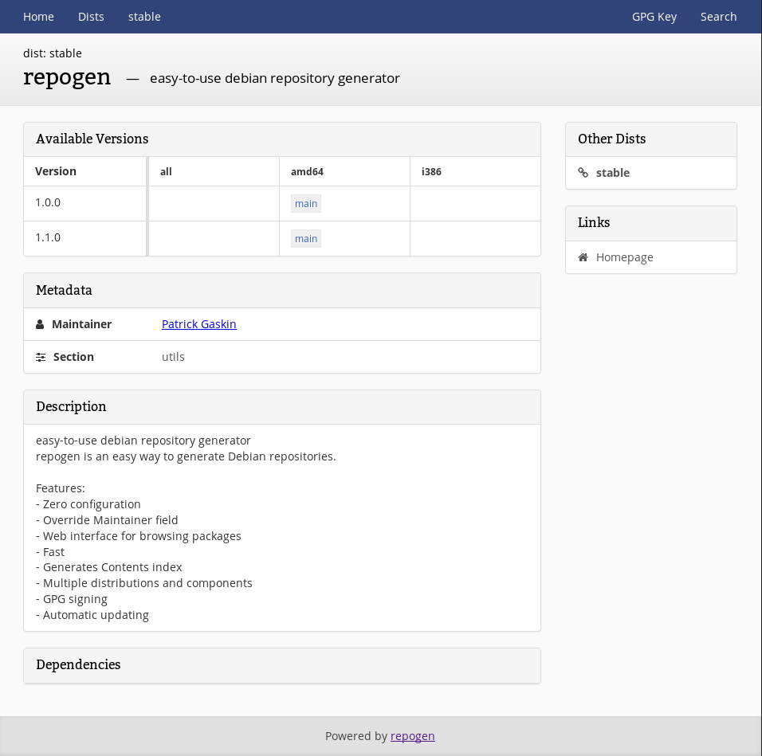

# repogen
repogen is an easy way to generate a Debian repository.

repogen supports signing, generating a Contents index, overriding the Maintainer field on packages, a web interface, package search, automatically updating the repository, and more.

### Installation
repogen can be downloaded from the [releases](https://github.com/geek1011/repogen/releases/latest) page, or installed from the debian [repository](https://deb.geek1011.net/packages/stable/).

### Quick Start
1. Create a directory named `in`
2. Inside that folder, create a folder for each distribution, such as `stable` or `stretch`.
3. Inside each distribution folder, create a folder for each component, such as `main` or `non-free`.
4. Place the deb packages in the component folders.
5. Export a gpg private key in ascii-armour format (with no passphrase) to `private-key.asc`
6. Run `repogen --generate-web --generate-contents ./private-key.asc ./in ./out`
7. Run a web server of your choice with the `out` directory as the root. You will now be able to use this as your repository.

Note: for repositories with >50 packages, it is recommended to install nodejs on the server so the packages are not indexed client-side.

### Usage

````
Usage: repogen [OPTIONS] PRIVATE_KEY_FILE INPUT_DIR OUTPUT_DIR

Version:
  repogen

Options:
  -d, --description string           sets the description field used in the Release file (default "Generated by repogen")
  -c, --generate-contents            generates the Contents index (makes repogen slower to load)
  -b, --generate-web                 generate a web interface for browsing the packages
  -h, --help                         show this help text
  -m, --maintainer-override string   overrides the maintainer of all packages (format: First Last <email@address.com>)
  -o, --origin string                sets the origin field used in the Release file (this field is used as a user-friendly way to identify the repository) (default "repogen")
      --version                      show the version
  -w, --watch                        watch the input directory for new packages
  -i, --watch-interval duration      the interval to check for new packages (if watch is enabled) (default 1s)

Arguments:
  PRIVATE_KEY_FILE is the path to a ascii-armoured gpg private key with no passphrase. It is used to sign the repository.
  INPUT_DIR is the path to the directory containing the deb packages. It should be in the following layout (and must not contain any unrelated files): INPUT_DIR/dist/component/*.deb
  OUTPUT_DIR is the path to place the generated repository in. It must not exist.
````

### Screenshots

|  |
| --- |
| Web Interface - Package |
